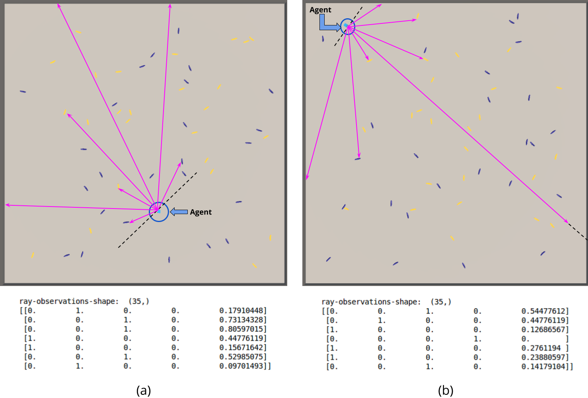
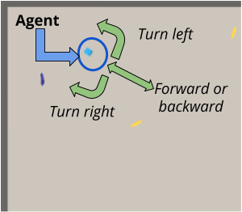

# Navigation

---

Hi! this repo is about the udacity navigation project where we will learn an agent to go around and get some bananas. more speicifically the yellow bananas, while the blue one must be avoided!

if you want to follow along the first thing you need to do is setup the enviroment by following [this instructions](./Setup.ipynb)

# State

the state represents 7 rays going out from the agents coded in 5 dimension. the first 4 is what the ray hit (yellow banana, blue banana, wall, nothing) and followed by the distance of the hit object.
the last 2 number represent the speed of the agent. 

---

our state is 7 rays * (4 class dimensions, 1 distance dimention) + 2 speed  => 7* 5 + 2 => 37 dimensions state

# Actions

The avalible actions are 4:

- Action 0: Move forward.
- Action 1: Move backward.
- Action 2: Turn left.
- Action 3: Turn right.

# Resolution

The Enviroment will be solved when the Agent scores more than 13 points in avarage over 100 episodes.

# Instruction

if you want to follow along you should downlonad this repo, follow the setup in [this instructions](./Setup.ipynb)

and then train the agent(s) and follow along  [the jupeter notebook](./Main.ipynb)